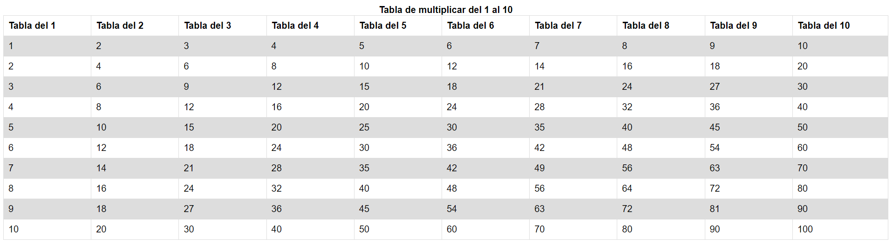

# PHP | Práctica 2 | Tabla de multiplicar del 1 al 10

**Table of contents**

- [Introducción](#introducción)

## Introducción

Práctica en PHP en un servidor Apache, en la que tuvimos que hacer una tabla de multiplicar con el propósito de publicarla luego en internet desde una red local con la aplicación [ngrok](https://ngrok.com/).

