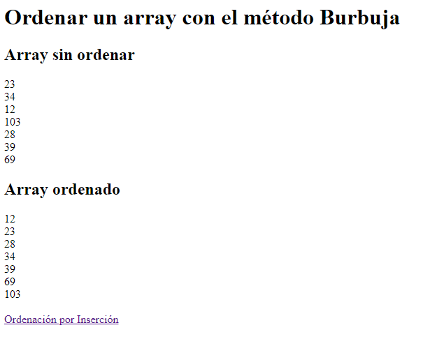

# PHP | Práctica 3 | Ordenar un array con el método Burbuja

**Table of contents**

- [Introducción](#introducción)

## Introducción

Práctica en PHP para programar un algoritmo de ordenación con el [método Burbuja](https://en.wikipedia.org/wiki/Bubble_sort) y el [método Inserción](https://en.wikipedia.org/wiki/Insertion_sort).

