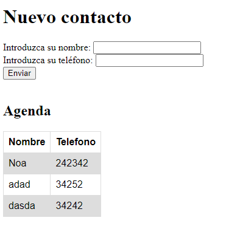

# PHP | Práctica 4 | Formulario

**Table of contents**

- [PHP | Práctica 4 | Formulario](#php--práctica-4--formulario)
  - [Introducción](#introducción)

## Introducción

Práctica en PHP para programar un formulario con el que introducir contactos (nombre + número de teléfono) en una agenda. Se pueden editar los números al introducir el nombre del contacto con un número distinto, y borrar el contacto introduciendo solo su nombre.  

