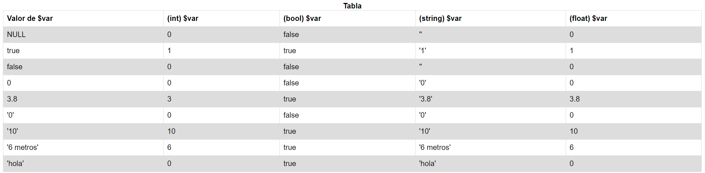

# PHP | Práctica 1 | Conversión entre tipos de datos

**Table of contents**

- [Introducción](#introducción)

## Introducción

Primera práctica en PHP en un servidor Apache, en la que tuvimos que hacer una conversión entre diferentes tipos de datos en PHP.

