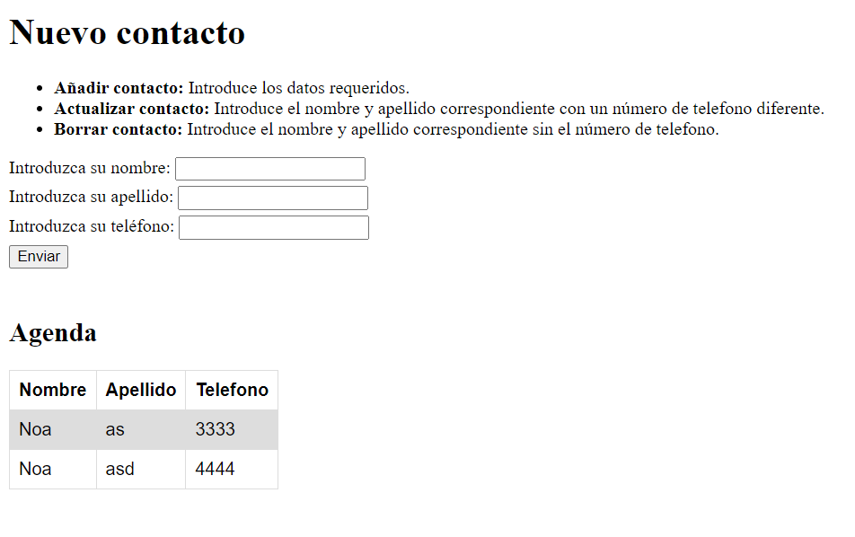

# PHP | Práctica 1 | Formulario + Base de datos

**Table of contents**

- [PHP | Práctica 1 | Formulario + Base de datos](#php--práctica-1--formulario--base-de-datos)
  - [Introducción](#introducción)

## Introducción

Práctica en PHP para programar un formulario con el que introducir contactos (nombre + apelllido + número de teléfono) en una agenda, añadiendole esta vez una base de datos para que los datos persistan. Se pueden editar los números al introducir el nombre del contacto con un número distinto, y borrar el contacto introduciendo solo su nombre.  

