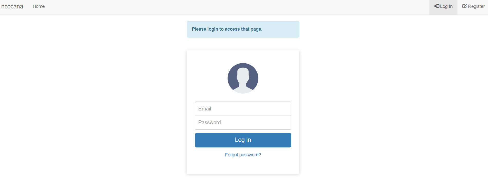

# PHP | Práctica 2 | Login system

**Table of contents**

- [PHP | Práctica 2 | Login system](#php--práctica-2--login-system)
  - [Introducción](#introducción)

## Introducción

Práctica en PHP consistente en crear un sistema de login con una base de datos en PostgreSQL, validación de email, y reseteo de contraseña.   

El link de la aplicación en remoto es: [ncocana_login.randion.es](ncocana_login.randion.es).

