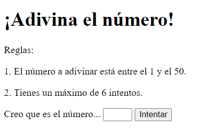

# PHP | Práctica 5 | Adivina el número

**Table of contents**

- [PHP | Práctica 5 | Adivina el número](#php--práctica-5--adivina-el-número)
  - [Introducción](#introducción)

## Introducción

Práctica en PHP para programar un juego que consiste en adivinar un número al azar entre el 1 y el 50 en un máximo de 6 intentos.

