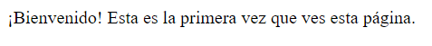

# PHP | Práctica 1 | Cookies

**Table of contents**

- [PHP | Práctica 1 | Cookies](#php--práctica-1--cookies)
  - [Introducción](#introducción)

## Introducción

Práctica en PHP para crear cookies por primera vez.

